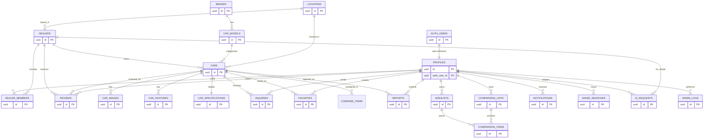

# ER Diagram

```mermaid
erDiagram
  AUTH_USERS ||--|| PROFILES : "auth reference"
  PROFILES ||--o{ DEALER_MEMBERS : joins
  DEALERS ||--o{ DEALER_MEMBERS : includes
  DEALERS ||--o{ CARS : owns
  DEALERS ||--o{ REVIEWS : receives

  BRANDS ||--o{ CAR_MODELS : has
  CAR_MODELS ||--o{ CARS : categorizes
  LOCATIONS ||--o{ CARS : located_in
  LOCATIONS ||--o{ DEALERS : based_in

  CARS ||--o{ CAR_IMAGES : has
  CARS ||--o{ CAR_FEATURES : has
  CARS ||--|| CAR_SPECIFICATIONS : details
  CARS ||--o{ INQUIRIES : receives
  CARS ||--o{ FAVORITES : saved_as
  CARS ||--o{ COMPARE_ITEMS : compared_in
  CARS ||--o{ REVIEWS : reviewed_for
  CARS ||--o{ REPORTS : reported_as

  PROFILES ||--o{ FAVORITES : creates
  PROFILES ||--o{ WISHLISTS : owns
  WISHLISTS ||--o{ COMPARISON_ITEMS : stores
  PROFILES ||--o{ COMPARISON_LISTS : owns
  COMPARISON_LISTS ||--o{ COMPARISON_ITEMS : contains
  PROFILES ||--o{ INQUIRIES : sends
  PROFILES ||--o{ NOTIFICATIONS : receives
  PROFILES ||--o{ SAVED_SEARCHES : saves
  PROFILES ||--o{ AI_REQUESTS : initiates
  PROFILES ||--o{ REPORTS : submits
  PROFILES ||--o{ ADMIN_LOGS : performs

  DEALERS ||--o{ AI_REQUESTS : for_dealer
  PROFILES ||--o{ REVIEWS : writes

  AUTH_USERS {
    uuid id PK
  }
  PROFILES {
    uuid id PK
    uuid auth_user_id FK
  }
  DEALERS {
    uuid id PK
  }
  DEALER_MEMBERS {
    uuid id PK
  }
  BRANDS {
    uuid id PK
  }
  CAR_MODELS {
    uuid id PK
  }
  CARS {
    uuid id PK
  }
  CAR_IMAGES {
    uuid id PK
  }
  CAR_FEATURES {
    uuid id PK
  }
  CAR_SPECIFICATIONS {
    uuid id PK
  }
  LOCATIONS {
    uuid id PK
  }
  FAVORITES {
    uuid id PK
  }
  WISHLISTS {
    uuid id PK
  }
  COMPARISON_LISTS {
    uuid id PK
  }
  COMPARISON_ITEMS {
    uuid id PK
  }
  REVIEWS {
    uuid id PK
  }
  INQUIRIES {
    uuid id PK
  }
  NOTIFICATIONS {
    uuid id PK
  }
  SAVED_SEARCHES {
    uuid id PK
  }
  AI_REQUESTS {
    uuid id PK
  }
  REPORTS {
    uuid id PK
  }
  ADMIN_LOGS {
    uuid id PK
  }
```

> Note: `auth.users` is a Supabase Auth table and is referenced, not owned, by the application schema.
